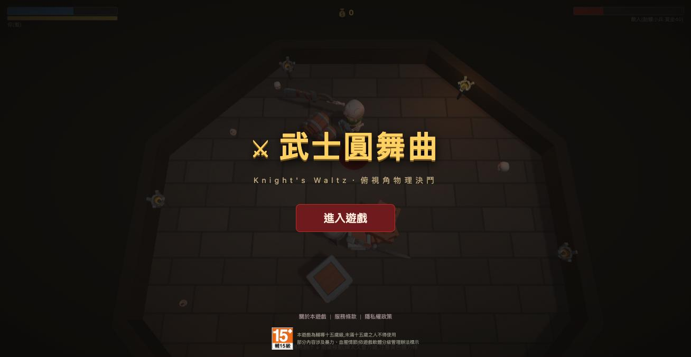

# 武士圓舞曲 Knight's Waltz

俯視角物理決鬥遊戲(Web 3D)。**[▶ 直接遊玩](https://satsumacreative.tw/kw/)**(免安裝,桌機鍵盤操作)

武器不是播動畫,是真的物理——劍有重量、旋轉有慣性、傷害由劍刃接觸點的相對速度決定。Three.js + Rapier(WebAssembly)+ TypeScript,無遊戲引擎。

`npm run dev` 開發、`npm run build` 打包。

## 緣起

這個專案一開始只是想試試看:現在的網頁 3D(Three.js + WebAssembly 物理引擎)到底能做到什麼程度。

做著做著想起很久以前 Apple II 時代玩過的一款俯視角武士決鬥遊戲——左右鍵旋轉身體甩劍、上下鍵前後移動,傷害來自揮劍的速度,名字已經不可考。就用現代的網頁技術把記憶中的手感重現出來,然後往上加了物理手臂與盾牌格擋、裝備商店、關卡階梯、體力系統和斷肢。

武器不是播動畫,是真的物理:劍有重量、旋轉有慣性、砍中的傷害由劍刃接觸點的相對速度決定,格擋是盾牌實體把劍彈開。

## 素材授權

- `public/models/` 角色/武器/盾牌模型與貼圖:[KayKit](https://kaylousberg.itch.io/)(Character Pack: Adventurers、Skeletons;場景道具出自 Dungeon Remastered、Halloween Bits;Kay Lousberg 製作,**CC0**)
- `public/sfx/` 音效:[Kenney](https://kenney.nl)(Impact Sounds、RPG Audio,**CC0**)
- `public/bgm_waltz.m4a` 背景音樂:小約翰・史特勞斯《藍色多瑙河》,美國海軍陸戰隊軍樂團錄音(公有領域,Wikimedia Commons)

CC0 素材免費商用、無需署名,此處仍列出以示感謝。

## 授權

- **程式碼**:[GPL-3.0](LICENSE) © [薩摩創意 Satsuma Creative](https://satsumacreative.tw)。可自由使用、修改、商用,但衍生作品必須以同樣條款公開源碼。
- **素材不在 GPL 授權範圍**:`public/models/`(KayKit,CC0)、`public/sfx/`(Kenney,CC0)、`public/bgm_waltz.m4a`(公有領域錄音)為第三方素材,依其原始授權使用,本專案無權對其再授權;出處見上方「素材授權」。
- 「武士圓舞曲 / Knight's Waltz」名稱與線上服務(帳號、存檔、排行榜)不隨程式碼授權。
